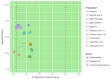

# Customer Decision Hub Data Scientist Tools

Utilities, tools and demo scripts for data scientists to work with Pega DSM/CDH.

We release this under the Apache 2.0 license and welcome contributing back, preferably through pull requests, but just submitting an Issue or sending a note to the authors is fine too.

## R

[](https://travis-ci.org/pegasystems/cdh-datascientist-tools)
[](https://codecov.io/gh/pegasystems/cdh-datascientist-tools)

The **cdhtools** package can be installed straight from GitHub and provides a number of utility functions and demo scripts.

To install the package use the **devtools** package. If you don't have that installed yet, do that first:

```r
install.packages("devtools")
```

Then load the **devtools** library and install the **cdhtools** package. Note the `build_vignettes` flag. By default packages built from GitHub do not include the vignettes, but these contain the demo scripts, so you should include them. In the world of R, vignettes are what you would call examples or demo's in other environments.

```r
library(devtools)
install_github("pegasystems/cdh-datascientist-tools/r", build_vignettes=TRUE)
```

If all is well, this will then install an R package called **cdhtools** that you can then use just like any other R package. You can quickly check this by running the following R commands:

```r
library(ggplot2)
library(scales)
library(tidyverse)

library(cdhtools)
data(admdatamart_models) # Example data included in cdhtools

ggplot(admdatamart_models %>%
  mutate(Performance = 100*pyperformance,
         Responses = pypositives+pynegatives,
         AcceptRate = pypositives/(pypositives+pynegatives)),
  aes(Performance, AcceptRate, colour=pyname, shape=pyconfigurationname, size=log(Responses)))+
  geom_vline(xintercept=c(52,90), linetype="dashed")+
  geom_point(alpha=0.7) +
  guides(colour=guide_legend(title="Proposition"), shape=guide_legend(title="Model"), size=FALSE)+
  scale_x_continuous(limits = c(50, 100), name = "Proposition Performance") +
  scale_y_continuous(limits = c(0, 1), name = "Success Rate", labels = scales::percent) +
  theme(panel.background = element_rect(fill='lightgreen'))
```

This loads a sample dataset from the packages that represents the state of a couple of ADM models taken from the ADM Data Mart and plots success rate vs performance. Similar to the standard report in the Analytics Center, but across multiple model rules. This example is from one of the vignettes that is shipped with the package, `adm-reporting`. You should get an output like this:



We use vignettes as the primary vehicle for demo scripts that show how to make use of the package. The source of the vignettes itself is typically useful as this can be customized to specific needs and situations.

The available vignettes are:

Vignette | Description | Command to read it
------------ | ------------- | -------------
adm-reporting | Reporting on the ADM Datamart | `vignette("adm-reporting")`
adhoc-datasetanalysis | Using Dataset Exports | `vignette("adhoc-datasetanalysis")`

For those less familiar with R vignettes: you can get the list of vignettes with `browseVignettes("cdhtools")` (as a web page) or `vignette(package="cdhtools")`. A vignette provides the original source as well as a readable HTML or PDF page and a file with the R code. Read a specific one with `vignette(x)` and see its code with `edit(vignette(x))`.

The other option is to download the source (clone from the GitHub repository) and use the functions and demo scripts directly. Just clone the repository and explore the package contents. The R code, tests, vignettes etc are in the **r** subdirectory.

## Python

Only the cdh_utils module has been implemented in the Python package.

To import the module we can type

```python
import cdh_utils as cu
```

Then, we can run the different functions in this module.
For example, for the readDSExport function we can run:
```python
df1 = cu.readDSExport("Data-Decision-ADM-ModelSnapshot_AllModelSnapshots", srcFolder="inst/extdata", tmpFolder="tmp3")
df2 = cu.readDSExport("Data-Decision-ADM-ModelSnapshot_AllModelSnapshots_20180316T134315_GMT.zip", srcFolder="inst/extdata", tmpFolder="tmp3")
```
